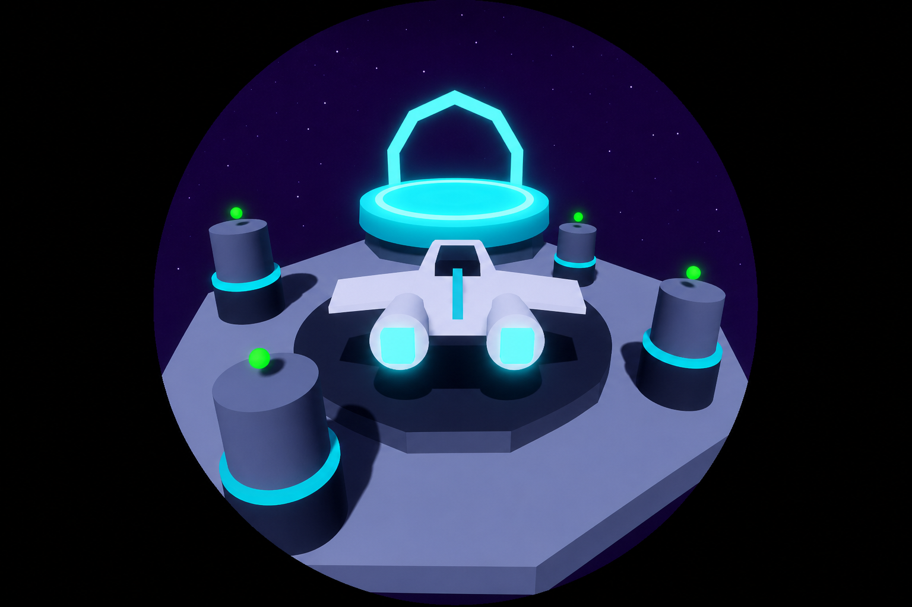
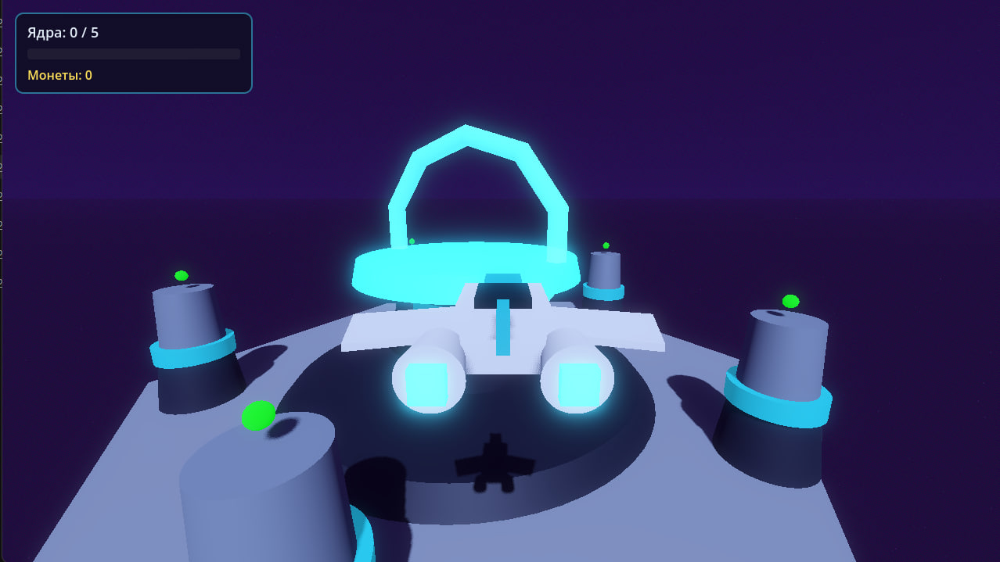
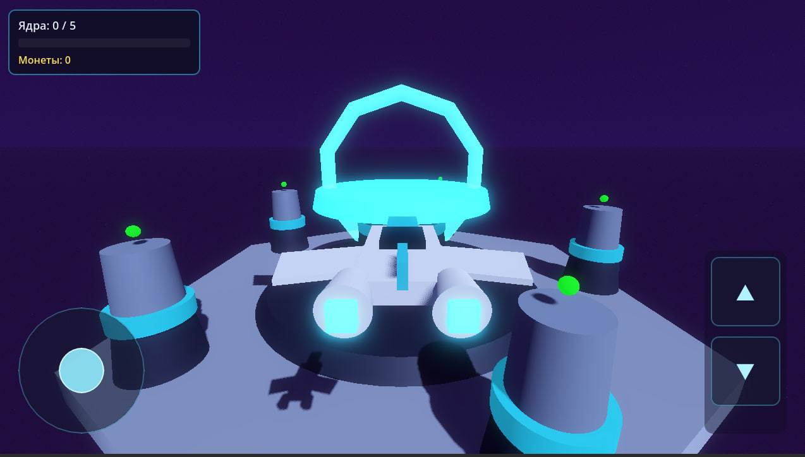

# EnergoDrone

3D-мини-игра на **Godot 4.6** для **Windows** и **Android**.  
Управляйте белым перехватчиком, собирайте энергетические ядра на генераторах и сдавайте их на центральную стойку.

---

## Скриншоты

### Windows

### Android

---

## Скачать

Готовые сборки — без установки Godot:

**[Yandex Диск — файлы проекта](https://disk.yandex.ru/d/x5KIVnR0HohtUQ)**
**[Google Диск — файлы проекта](https://drive.google.com/drive/folders/13NhurAylJsAE7WTJIjoGgQWAhdy0KY4F?usp=sharing)**

| Платформа | Файлы | Запуск |
|-----------|-------|--------|
| Windows | `.exe`, `.pck` | Открыть `.exe` |
| Android | `.apk` | Установить на устройство |

---

## Геймплей

Арена — **шестиугольная платформа** в космосе. В **центре** — стойка для сдачи ядер, по краям — **генераторы-башни**.

1. Вылетите с центра и найдите башню с ядром.
2. Дождитесь полной зарядки — ядро сменит цвет (красный → жёлтый → зелёный).
3. Подберите ядро. В трюме помещается до **5** штук.
4. Вернитесь на центральную стойку и оставайтесь в зоне сдачи ~3 секунды.
5. Получите монеты — прогресс сохраняется между запусками.

> Незрелые ядра отталкивают корабль. Подбирать можно только полностью заряженные.

---

## Управление

### ПК

| Действие | Клавиша |
|----------|---------|
| Вперёд / назад / влево / вправо | `W` `A` `S` `D` |
| Вверх / вниз | `Пробел` / `Shift` |
| Камера | Мышь |
| Отпустить курсор | `Esc` |
| Вернуть захват | Клик по окну |

### Android

| Действие | Элемент |
|----------|---------|
| Полёт | Джойстик (слева внизу) |
| Высота | Кнопки **▲** / **▼** (справа внизу) |
| Камера | Свайп по правой половине экрана |

---

## Особенности

- Low-poly 3D графика, фиолетовый космический фон
- Плавная физика полёта с инерцией
- HUD с полосой заполненности трюма
- Управление мышью и сенсорным экраном

---

## Технологии

Godot Engine 4.6 · GDScript · Windows · Android
